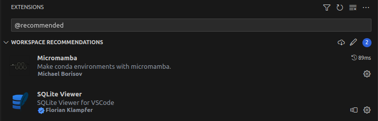

# Caixa

## Ambiente

### Instalação do `Node.js` e `npm`

Existem algumas formas para instalar o `Node.js` e `npm`, como:

- Instaladores do site: https://nodejs.org/en/download

  Recomendado para `Windows` e `macOS`.

- `APT`

      sudo apt install nodejs npm

  Recomendado para distribuições `Linux` beseadas em `Debian`.

- Gerenciador de pacotes, como `Conda` e `Mamba`, utilizando o arquivo `environment.yml` neste repositório.

  Recomendado para isolar os pacotes instalados do Sistema Operacional e ser independente de plataforma.

  No próximo tópico, iremos instalar e configurar o ambiente com o gerenciador de pacotes `micromamba` dentro de uma instância do `Visual Studio Code`.

  Para mais informações:

    - https://mamba.readthedocs.io/en/latest/installation.html
    - https://mamba.readthedocs.io/en/latest/user_guide/micromamba.html

### Visual Studio Code

Com o VSCode aberto, instale as extensões recomendadas em `./.vscode/extensions.json`. Use `Crtl + P` e entre:

    ext install corker.vscode-micromamba

  

    ext install qwtel.sqlite-viewer

Após a instalação da extensão `micromamba`, utilize `Ctrl + Shift + P` e entre o comando:

    >micromamba create environment

A extensão irá instalar o `micromamba` em `./.micromamba/` e em seguida instalar os pacotes necessários no ambiente local do projeto, listados em `environment.yml`.

Os pacotes (`nodejs` e `nmp`) estarão instalados em `./.micromamba/` e não no Sistema Operacional. Assim, poderemos utilziar os pacotes necessários dentro desta instância do VSCode e poder atualizar ou apagar o ambiente quando desejado, excluindo tudo o que foi instalado.

No canto inferior esquerdo do VSCode, irá aparecer o ambiente `micromamba` (`μenv[Caixa]`) ativo.

**Observação:** É necessário abrir um novo terminal para que o `micromamba` esteja disponível e talvez seja necessário reiniciar o VSCode para ativar o ambiente.

Você pode verificar os pacotes instalados com o `micromamba` com o seguinte comando no terminal do VSCode:

    micromamba list

E assim vemos que o `nodejs` está instalado e pronto para uso.

### Instalação das dependências do `Node.js`

Dentro do terminal no VSCode, entre:

    npm install

O comando irá verificar e instalar todas as dependências dentro do arquivo `./package.json`. O local de instalção será o diretório `./node_modules/`.

### Banco de Dados

A aplicação utilizará um banco de dados embutido, o `SQLite`, uma implementação de código aberto multiplataforma que não requer qualquer tipo de instalação ou manutenção, simplificando nossa tarefa.

Mais informações em:

- https://www.sqlite.org/index.html
- https://en.m.wikipedia.org/wiki/SQLite

O banco de dados, em arquivo único, estará disponível em `./database/database.sqlite`, podendo ser apagado, caso necessário. Suas modificações serão ignoradas em commits por meio do `.gitignore`.

Com a extensão `SQLite Viewer`, podemos abrir o arquivo do banco de dados para vizualizar as tabelas criadas e os dados que serão inseridos.

## Projeto `Caixa`

Nosso projeto consiste na execução de testes unitários utilizando `jest` e `supertest` em um servidor `HTTP`.

Informações sobre as bibliotecas

- https://jestjs.io/pt-BR/docs/getting-started
- https://www.npmjs.com/package/supertest

### Por que testes unitários em HTTP?

Testes unitários são uma metodologia que procura verificar a corretude do código em sua menor fração. Em nosso caso, os testes verificam se a aplicação está se comportando corretamente ao cadastrar um usuário, retornando erros quando os campos necessários não são enviados, quando a senha está incorreta ou o email não está registrado etc.

A importância desses testes é garantir que a aplicação esteja funcionando corretamente e que os erros sejam tratados de maneira adequada. Isso ajuda a prevenir problemas futuros e a garantir uma melhor experiência para o usuário. Além disso, os testes unitários podem ser executados automaticamente sempre que o código for alterado, garantindo que as alterações não introduzam novos bugs.

Para mais informações:

- https://www.devmedia.com.br/introducao-aos-testes-unitarios-em-javascript/28236
- https://www.devmedia.com.br/introducao-aos-testes-unitarios-em-javascript/28236

### Arquivos do projeto

Os arquivos estão disponíveis no diretório `./src/`, da seguinte forma:

    .
    ├── app
    │   ├── controllers
    │   │   └── User.js
    │   └── schemes
    │       └── Usuario.js
    ├── database
    │   └── index.js
    ├── index.js
    └── test
        └── user.test.js

Os arquivos mencionados abaixo terão como ponto de referência a pasta `./src/`.

### Tabela de usuários

A tabela de usuários será criada de acordo com o script de `app/schemes/Usuario.js`, sendo os campos para usuários:

- `id` (chave primária): número inteiro
- `nome`: texto
- `email` (único): texto
- `senha`: texto
- `dataCriacao`: tempo
- `administrador`: booleano

### Implementação dos testes

Os testes estão disponíveis no script `test/user.test.js`, que implementa um conjunto de testes automatizados utilizando a biblioteca `supertest` para testar um servidor `HTTP` com endpoints relacionados à autenticação de usuários.

### Execução dos testes

Para execução dos testes unitários, utilizamos o comando a seguir:

    npm test

